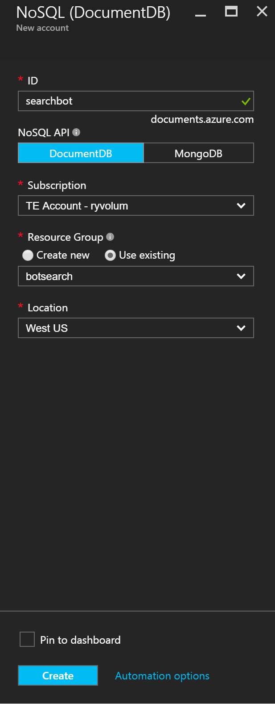
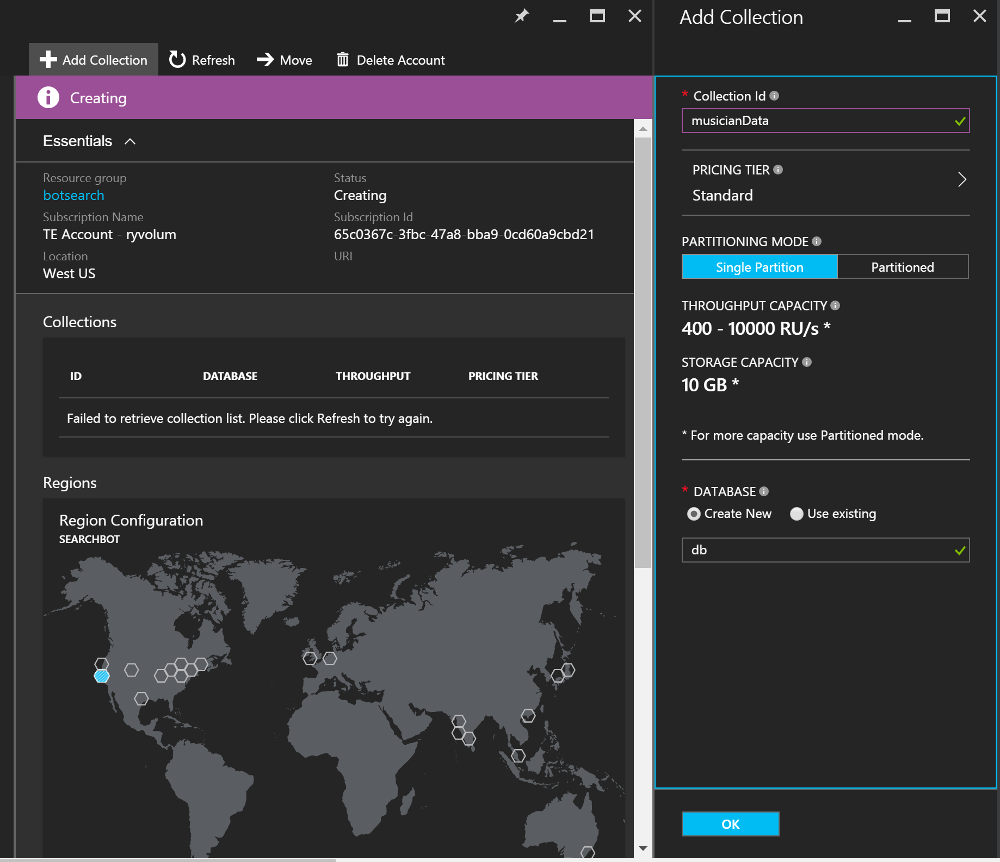
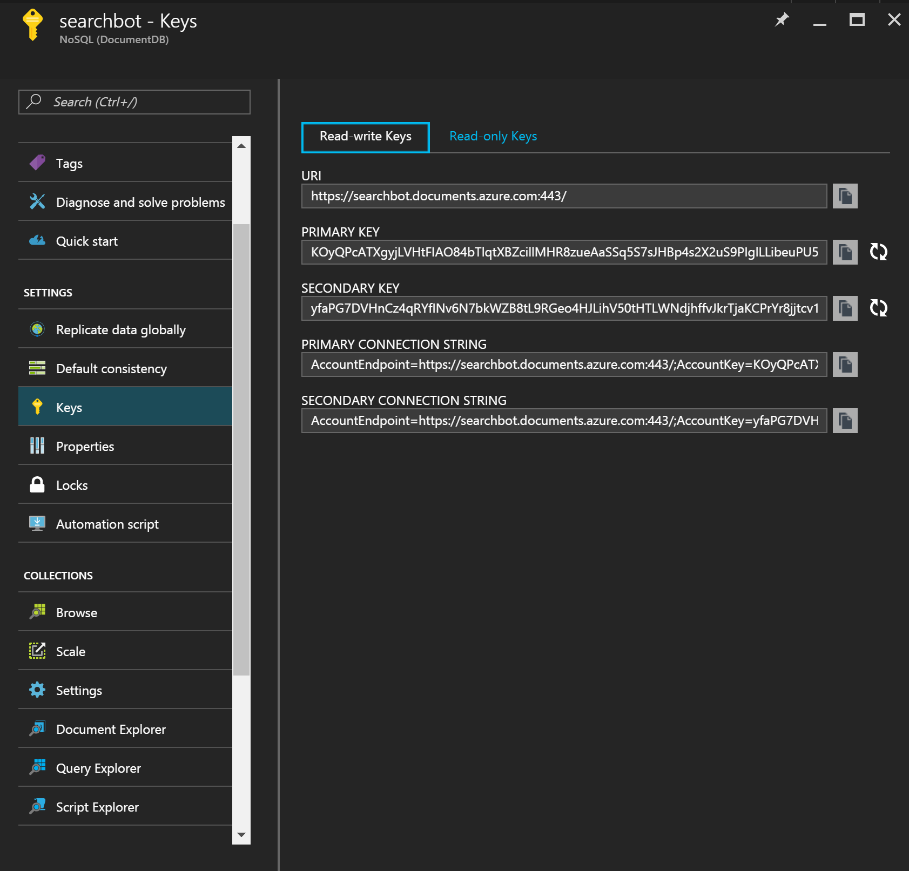
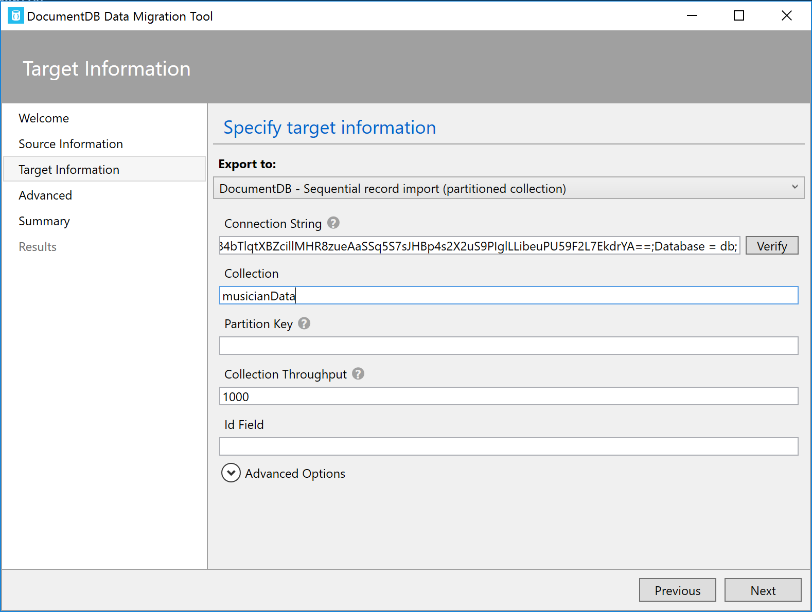
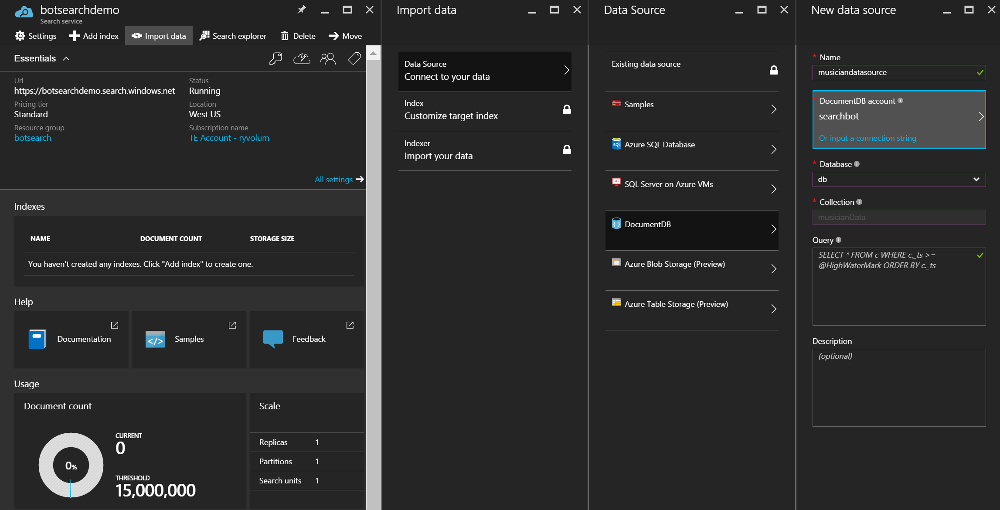
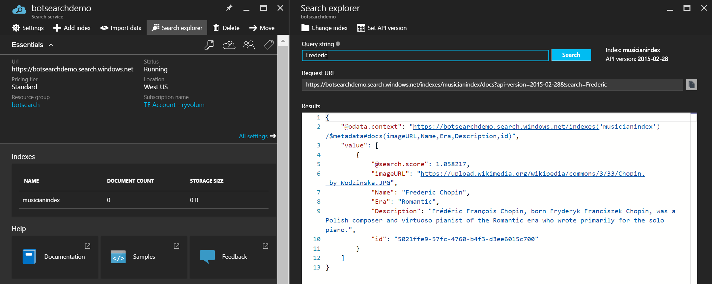

# Using Search to Create Data Driven Bots

In this demo I'll demonstrate how to use Azure Document DB, Azure Search and the Microsoft Bot Framework to build a bot that searches and filters over an underlying dataset.

## Background
More and more frequently we're seeing the value in bots that can reason over underlying data. These bots can help provide users with information about events, products, telemetry etc. Where it's certainly possible to connect a bot directly to a database and perform queries against it, we've found that using a search engine over our data is particularly helpful for two big things: 

1. Indexing and searching an underlying dataset to return the results that best match user input. 

    * For one, fuzzy search keeps users from having to type exact matches (e.g. "who is jennifer?" instead of "jennifer marsman", "impala" instead of "Tame Impala")

        
        

    * Search scores allow us to determine the confidence that we have about a specific search - allowing us to decide whether a piece of data is what a user is looking, order results based on our confidence, and curb our bot output based on confidence (e.g. "Hmm... were you looking for any of these events?" vs "Here is the event that best matches your search:") 

        
        

2. Guiding a user through a conversation that facets and filters a dataset until it finds what a user is looking for. In this example, we use search to determine all of the facets of the underlying database's fields to quickly guide the conversation:

    
    
    
    


I'm going to demonstrate the creation of a simple bot that searches and filters over a dataset of classical musicians. First we'll set up our database, then we'll create our search service, and then we'll build our bot.

## Database Setup - DocumentDB 
I'll start by noting [musician JSON file](./data/clasicalMusicians.json), found in the data folder of this project. Each JSON object is made up of four properties: musician name, era, description, and image url. Our goal will be to allow users to quickly find a specific musician or filter musicians by their different eras. Our dataset only contains 19 musicians, but this approach can easily scale to millions of data points. Azure Search is capable of indexing data from several data sources including Document DB, Blob Storage, Table Storage and Azure SQL. We'll use Document DB as a demonstration. 

### Create a Document DB database and collection. 
1. Navigate to Document DB in the Azure Portal 

    
                                  
2. Create Doc DB account

    

3. Create collection/add new DB

    


### Upload JSON data
Now that we've got our database and collection set up, let's go ahead and push our JSON data up. We can do this programatically, but for the
sake of simplicity I'm going to use the Document DB Data Migration Tool (documented here https://azure.microsoft.com/en-us/documentation/articles/documentdb-import-data/).

1. Once you've got the tool, navigate to the musician JSON data: 

    

2. Fill in target information

    1. Get connection strings from portal

        

    2. Be sure to add Database = <DatabaseName>; to your connection string

        

    3. Then upload your data: 

        

    To see that our data has uploaded, we can go back to the portal, click query explorer and run the default query `SELECT * FROM c`:
        

3. Create your Azure Search index

    1. Create an Azure Search service

        

    2. Import Data from your Document DB collection

        
    
    3. Create your Azure Search index

        Here's where the magic starts to happen. You can see that Azure Search has accessed our data and pulled in each parameter of the JSON objects. Now we get to decide which of these parameters we want to search over, facet over, filter by and retrieve. Again we could generate our indeces programically, and in more complex use cases we would, but for the sake of simplicity we'll stick to the portal UI. Given that we want access to all of these properties we'll go ahead and make them all retrievable. We want to be able to facet (more details about faceting to come) and filter over musician's eras. Finally, we'll mark name as searchable so that our bot can search for musicians by their names. 

        

4. Create your Azure Search indexer
    As our data is subject to change, we need to be able to reindex that data. Azure Search allows you to index on a schedule or on demand, but for this demo we'll index once only.

    

5. Use the Search explorer

    We can verify that our index is properly functioning by using the Azure Search Explorer to enter example searches, filters and facets. This can be a very useful tool in testing out queries as you develop your bot. Note: If you enter a blank query the explorer should return all of your data. 
    
    Let's try three different queries:
    
    * `"Frederic"`

    Given that our index searches over musician name, a search of "Frederic" returns the information for "Frederic Chopin" along with a search score. The search score represents the confidence that Azure Search has regarding each result. 

    
    
    If we search instead for "Johannes", we will get two pertinent results: one for Johannes Sebastian Bach and the other for Johannes Brahms

    * `facet=Era`

    Faceting allows us to see the different examples of a parameter and their corresponding counts. You can see here that the JSON response from the search API tells us that there are 11 Romantic musicians, 3 Classical musicians, 2 Baroque musicians and 1 Modernist musician:
            
    

    This information will allow us to guide the conversation our bot can have. If a user wishes to see musicians by era, our bot can quickly and efficiently find all the eras that are possible and present them as options to the user. 

    * `$filter=Era eq 'Romantic'`

    

4. Build your Bot

    The bot I will demonstrate is built in Node.js and C#. For understanding C# bot more, please see [this document](./CSharp/readme.md).
    This bot will be fairly simple, but if you're new to bot building several of the concepts might be foreign. For a quick ramp up check out [aka.ms/botcourse](http://aka.ms/botcourse), specifically the sections about setting up a node project, using cards and using dialogs. 

    All of our connector logic is being stored in the connectorSetup.js. Here's where you would enter your appId and appPassword if you were going to 
    make this bot live or connect it to a non-emulator channel. 

    Let's dive into the dialog logic now.

    We have two supporting dialogs - [musicianExplorer](./node/dialogs/musicianExplorer.js), which will provide a menu based system to explore the data, and [musicianSearch](./node/dialogs/musicianSearch.js), which allows the user to search for what they want. In each of the dialog files, you ill notice there is an **id**, **title**, and the **dialog**. The id is used when registering the dialog in the bot, while the title is used for the text that will trigger the dialog. Finally, the dialog property contains the code that will run. By doing this, we simplify the registration of the dialogs, and the flow of the bot. When looking at the code, you could see how this might be automated.

    ``` javascript
        // beginning in app.js
        const dialogs = {};
        dialogs.musicianExplorer = require('./dialogs/musicianExplorer.js');
        dialogs.musicianSearch = require('./dialogs/musicianSearch.js');

        // register the two dialogs after the bot is created
        // musicianExplorer will provide a facet or category based search
        bot.dialog(dialogs.musicianExplorer.id, dialogs.musicianExplorer.dialog)
            .triggerAction({ matches: new RegExp(dialogs.musicianSearch.title, 'i') });

        // musicianSearch will provide a classic search
        bot.dialog(dialogs.musicianSearch.id, dialogs.musicianSearch.dialog)
            .triggerAction({ matches: new RegExp(dialogs.musicianSearch.title, 'i') });
    ```

    All messages get routed into the root dialog. From here, we prompt the user by providing buttons. Buttons are an effective UI, as they help guide the user to the information they're searching for. By configuring the buttons to use `imBack`, the client will send the text back to the bot. As a result, we can simply end the conversation, and the bot will interpret the next message, just as if the user had typed it in. By using the title property, we simplify our code by not needing to know the name of the dialog. This might also be done programmatically.

    ```javascript
    // create the bot
    const bot = new builder.UniversalBot(connector, (session) => {
        const message = new builder.Message(session);
        message.text = 'How would you like to search?';
        message.attachments([
            new builder.ThumbnailCard(session)
                .buttons([
                    builder.CardAction.imBack(
                        session, dialogs.musicianExplorer.title, dialogs.musicianExplorer.title
                    ),
                    builder.CardAction.imBack(
                        session, dialogs.musicianSearch.title, dialogs.musicianSearch.title
                    )
                ])
                .title('How would you like to search?')
        ]);
        session.endConversation(message);
    });
    ```

    The musician search dialog first prompts the user to type in the name of the musician that he/she is looking for, and then executes the search. After the search is completed, the bot either displays the results, or a message indicating no results were found.

    ``` javascript
        // from ./Node/dialogs/musicianSearch.js
        // below is just the dialog
        (session) => {
            //Prompt for string input
            builder.Prompts.text(session, 'What are you searching for?');
        },
        (session, results) => {
            //Sets name equal to resulting input
            const keyword = results.response;

            searchHelper.searchQuery(keyword, (err, result) => {
                if (err) {
                    console.log(`Search query failed with ${err}`);
                    session.endConversation(`Sorry, I had an error when talking to the server.`);
                } else if (result) {
                    const message = messageHelper.getMusiciansCarousel(session, result);
                    session.endConversation(message);
                }
                session.reset('/');
            });
        }
    ```

    The dialog uses two helpers, a search helper and a message helper. The search helper contains the code necessary to make the search to Azure Search. The message helper simplifies the creation of the card. You can explore both of those files in the Node directory.

    > Note that our error handling for this example simply logs the error to console - in a real world bot we would want to be more involved in 
    our error handling. 

    Our musician explorer is a bit more involved. First it gathers our era facets and prompts the user to choose which one he/she is interested in. 
    Again it uses our search helper to perform the query, and retrieve the facets of our data.

    ```javascript
        // from ./Node/dialogs/musicianExplorer.js
        // the first method in the dialog
        (session) => {
            searchHelper.facetQuery(facetName, (err, result) => {
                if (err) {
                    console.log(`Error when faceting by ${facetName}: ${err}`);
                    session.endConversation(`Sorry, I ran into issues when talking to the server. Please try again.`);
                } else if (!result) {
                    session.endConversation(`I'm sorry, I couldn't find any to show you.`);
                } else {
                    const facetNames = [];
                    const buttons = [];
                    result.forEach(function (facet, i) {
                        facetNames.push(facet.value);
                        buttons.push(
                            builder.CardAction.imBack(session, facet.value, `${facet.value} (${facet.count})`)
                        );
                    });

                    // const message = new builder.Message(session);
                    const card = new builder.ThumbnailCard(session).buttons(buttons);
                    const message = new builder.Message(session).addAttachment(card);
                    card.title = `Which ${facetName} are you interested in?`;

                    //Prompts the user to select the era he/she is interested in
                    builder.Prompts.choice(session,
                        message,
                        facetNames
                    );
                }
            });
        },
    ```

    Once the user selects the era that they are interested in we perform a filter query via our search helper. Below is the bot code, which will perform a search on that facet, and then return the results (if there are any) to the user.

    ```javascript
        // from ./Node/dialogs/musicianExplorer.js
        // the second method in the dialog
        (session, results) => {
            //Chooses just the era name - parsing out the count
            const facetValue = results.response.entity;

            searchHelper.filterQuery(facetName, facetValue, (err, result) => {
                if (result) {
                    const message = messageHelper.getMusiciansCarousel(session, result);
                    session.endConversation(message);
                } else if (err) {
                    // error
                    console.log(`Error when filtering by ${facetValue}: ${err}`);
                    session.endConversation(`Sorry, I had an error when loading ${facetValue}`);
                } else {
                    // no results or error
                    session.endConversation(`I couldn't find any results in ${facetValue}.`);
                }
                session.reset('/');
            });
        }
    ```

    Finally, let's test our bot out. Either deploy your bot to an Azure web app and fill in the process.env variables in the portal, or add your search credentials in the config.js file. I will demonstrate the bot working in the bot framework emulator, but if deployed, this bot could be enabled on several different channels. 

    Musician Explorer functionality: 

    
    <br>
    

    Note that the search scores returned with the filtered results are always 1. This is because a filter is essentially an exact match

    Musician Search functionality

    
    <br>
    


